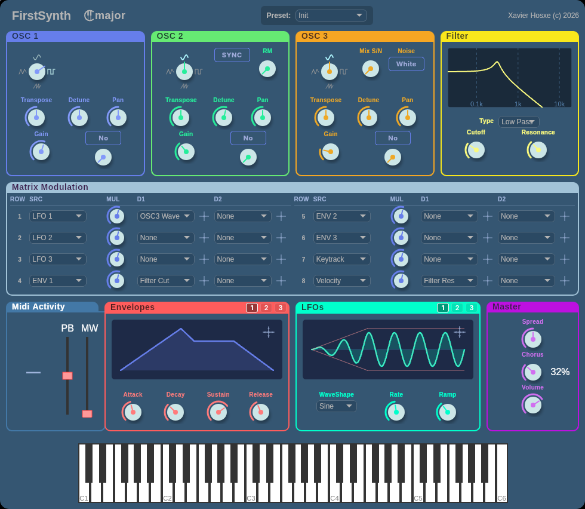

# FirstSynth

I created this synth as a learning project for the [Cmajor](https://cmajor.dev) language.

It's a 16-voice polyphonic subtractive synthesizer featuring classic synthesis tools: 
low/high/bandpass filters, 3 oscillators, saturators, matrix modulation, chorus effects, 
LFOs, and envelope generators. The interface is built with HTML, CSS, and JavaScript.

## Features

- **Three Oscillators** with waveshape morphing and independent detuning
- **Three Envelopes** for flexible amplitude and modulation control
- **Three LFOs** with adjustable rates for dynamic sound shaping
- **Matrix Modulation** – route any modulation source (LFO, envelope, velocity, keytrack) to any parameter
- **Stereo Effects** – integrated chorus and stereo spread processing
- **MIDI Support** – 16-note polyphony with MPE (MIDI Polyphonic Expression) compatibility
- **Web-based UI** – responsive, interactive controls including rotary knobs, sliders, and visual editors for envelopes and LFOs



## Project Structure

```
FirstSynth.cmajor          - Core audio engine
FirstSynth.cmajorpatch     - Patch manifest
view/
  index.js                 - Main UI controller
  gui/                     - Custom UI components (knobs, envelopes, LFO editors, etc.)
worker/
  worker.js               - Communication bridge between UI and audio engine
```

## Getting Started

1. Open this patch in Cmajor Studio or the Cmajor VSCode extension
2. The patch will compile and launch with the web-based UI
3. Use the controls to adjust synthesizer parameters in real-time
4. Connect a MIDI controller or use on-screen MIDI capability

## Requirements

- Cmajor 1.0 or later
- A Cmajor-compatible host (Cmajor Studio, VSCode extension, or DAW with Cmajor support)

## Controls Reference

- **Rotary Knobs** – Parameters like transpose, detune, gain, attack, release
- **Waveshape Knob** – Morph between oscillator waveforms
- **Envelope Editor** – visualize and adjust ADSR curves
- **LFO Editor** – draw custom waveforms and control modulation depth
- **Matrix Modulator** – drag to route modulation sources to destinations

---

*Xavier Hosxe*
